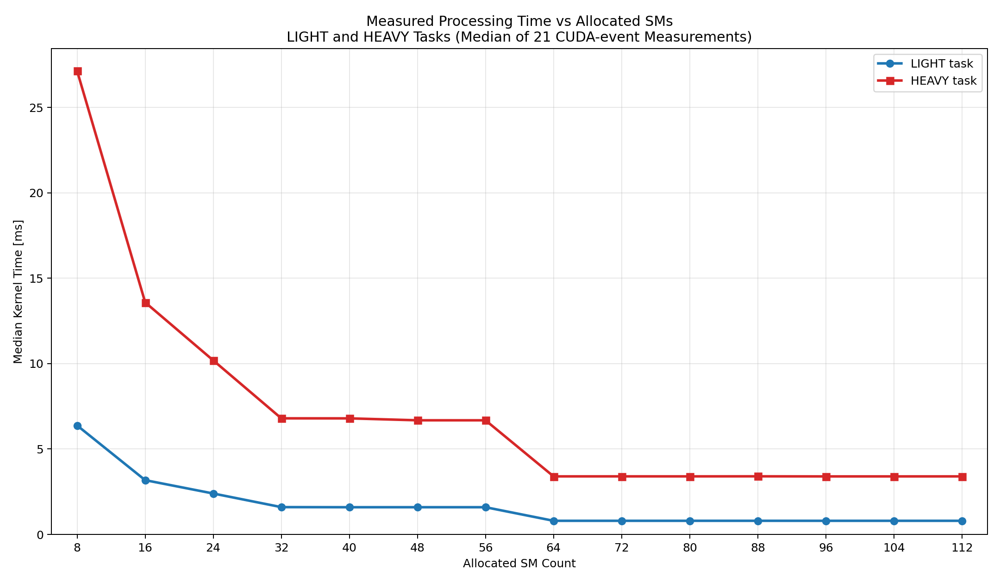

# SM Scaling Verification

`STG_my_method`で使用しているCUDAカーネルについて、割り当てSM数と実測処理時間の関係を確認するための検証用コードです。

検証コードは`STG_my_method`本体と分離しています。ただし、本体と同じカーネルを測定するため、次のヘッダを参照します。

```text
../STG_my_method/05_green_context_execution.cuh
```

## 検証内容

- NVIDIA H100 PCIeの114 SMを基準にする
- Green Contextの8 SM粒度で、8～112 SMを測定する
- 114 SMは通常のCUDA streamで測定する
- `STG_my_method`と同じLIGHT/HEAVYカーネルを使用する
- LIGHTは`650 * 80 = 52000 work units`
- HEAVYは`1000 * 200 = 200000 work units`
- 各SM数で5回ウォームアップする
- その後21回測定し、CUDA event時間の中央値を使用する

## コンパイル

```bash
cd /home/kobayashi/main/master_study/SM_scaling_verification

nvcc -O2 -std=c++20 benchmark_sm_scaling.cu \
  -I/home/kobayashi/taskflow \
  -o /tmp/benchmark_sm_scaling_verification
```

## 実行

```bash
/tmp/benchmark_sm_scaling_verification
```

コンパイルと実行を続けて行う場合は、次のコマンドを使用します。

```bash
cd /home/kobayashi/main/master_study/SM_scaling_verification

nvcc -O2 -std=c++20 benchmark_sm_scaling.cu \
  -I/home/kobayashi/taskflow \
  -o /tmp/benchmark_sm_scaling_verification && \
/tmp/benchmark_sm_scaling_verification
```

## グラフ生成

ベンチマークを実行し、8の倍数である8～112 SMのLIGHT/HEAVY実測時間を線グラフへ出力します。測定結果は標準出力から直接読み取るため、中間CSVは生成しません。

```bash
cd /home/kobayashi/main/master_study/SM_scaling_verification

nvcc -O2 -std=c++20 benchmark_sm_scaling.cu \
  -I/home/kobayashi/taskflow \
  -o /tmp/benchmark_sm_scaling_verification && \
python3 plot_sm_scaling.py /tmp/benchmark_sm_scaling_verification
```

出力先：

```text
/home/kobayashi/main/master_study/SM_scaling_verification/sm_scaling_light_heavy.png
```



## 出力項目

結果は標準出力に表示されます。CSVファイルなどは生成しません。

```text
kind,sm_count,median_ms,measured_slowdown,linear_114_over_sm,measured_over_linear
```

- `kind`: `LIGHT`または`HEAVY`
- `sm_count`: カーネルに割り当てたSM数
- `median_ms`: 21回測定した実行時間の中央値
- `measured_slowdown`: 114 SMの実測時間を1とした低速化倍率
- `linear_114_over_sm`: `114 / SM数`で計算した線形モデルの倍率
- `measured_over_linear`: 実測倍率を線形モデル倍率で割った値

## 実測結果

H100 PCIe（114 SM）で測定した結果です。時間は21回測定したCUDA event時間の中央値、倍率は114 SM時を1とした低速化倍率です。

| SM数 | 線形モデル `114 / SM` | LIGHT時間 [ms] | LIGHT実測倍率 | HEAVY時間 [ms] | HEAVY実測倍率 |
|---:|---:|---:|---:|---:|---:|
| 8 | 14.250 | 6.355872 | 7.949 | 27.140991 | 7.987 |
| 16 | 7.125 | 3.178976 | 3.976 | 13.580128 | 3.996 |
| 24 | 4.750 | 2.396832 | 2.998 | 10.186080 | 2.997 |
| 32 | 3.563 | 1.596288 | 1.996 | 6.785664 | 1.997 |
| 40 | 2.850 | 1.594432 | 1.994 | 6.792192 | 1.999 |
| 48 | 2.375 | 1.594080 | 1.994 | 6.680672 | 1.966 |
| 56 | 2.036 | 1.594656 | 1.994 | 6.680096 | 1.966 |
| 64 | 1.781 | 0.799872 | 1.000 | 3.400192 | 1.001 |
| 72 | 1.583 | 0.800096 | 1.001 | 3.400608 | 1.001 |
| 80 | 1.425 | 0.800096 | 1.001 | 3.400448 | 1.001 |
| 88 | 1.295 | 0.800448 | 1.001 | 3.402560 | 1.001 |
| 96 | 1.188 | 0.799264 | 1.000 | 3.397792 | 1.000 |
| 104 | 1.096 | 0.799360 | 1.000 | 3.397952 | 1.000 |
| 112 | 1.018 | 0.799616 | 1.000 | 3.398016 | 1.000 |
| 114 | 1.000 | 0.799552 | 1.000 | 3.398272 | 1.000 |

実測倍率をまとめると、LIGHT/HEAVYともに次の階段状になっています。

| SM範囲 | 114 SMに対する実測時間 |
|---:|---:|
| 8 SM | 約8倍 |
| 16 SM | 約4倍 |
| 24 SM | 約3倍 |
| 32～56 SM | 約2倍 |
| 64～114 SM | 約1倍 |

現在のカーネルでは、64 SMと114 SMの実行時間がほぼ同じです。これは予測上の仮定ではなく、現在の`kTaskElementCount = 64 * 256`とカーネル起動構成に対する実測結果です。

したがって、`proc_time * 114 / SM数`という完全な線形モデルは、特に8～64 SMの範囲で実測より大きな低速化を予測します。実行構成選択へ反映する場合は、この検証結果または追加測定した性能曲線を使用します。
